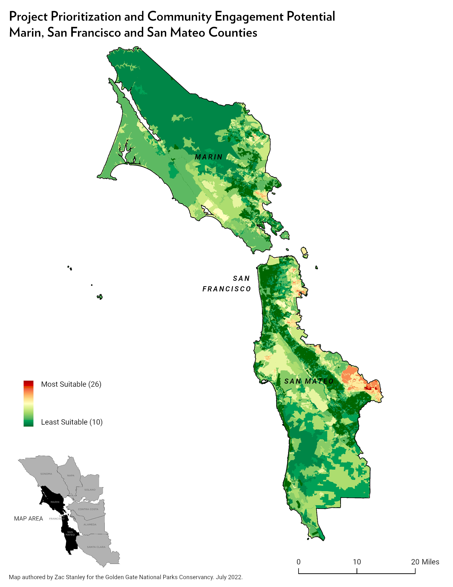

# Suitability Analysis for Generally Locating Priority Projects
Document describing data inputs and workflow process for developing priority projects suitability map for 3 county area. 

### Project folder:
C:\Users\zstanley\OneDrive - Golden Gate National Parks Conservancy\ClimateResilienceRacialJustice
### ArcGIS Pro Project:
C:\Users\zstanley\OneDrive - Golden Gate National Parks Conservancy\ClimateResilienceRacialJustice\ProjectsCommunityIndicators.aprx  
__Map Title:__ 'ProjectPrioritiesData_GGNRA'

## Project Consisted of Multiple input datasets in two categories: 

### Climate Resilience:

1. Sea level rise inundation vector polygon, bay side at maximum inundation 108" above current conditions at MHHW tidal datum from [Adapting to Rising Tides](https://explorer.adaptingtorisingtides.org/download)  
2. Sea level rise inundation vector, coast side areas inundated by unimpeded Pacific coastal flooding under a scenario of 1.4-meter (55-inch) sea-level rise in 2100 [Pacific Institute](https://www.pacinst.org/reports/sea_level_rise_data/Ca_coast_yr2100_flood.zip)  
3. Fire Hazard Severity Zones, these map areas of significant fire hazards based on fuels, terrain, weather, and other relevant factors. Vector file from the California Department of Forestry and Fire Protection. 2007. [FRAP Statewide Fire Hazard Severity](https://osfm.fire.ca.gov/divisions/community-wildfire-preparedness-and-mitigation/wildland-hazards-building-codes/fire-hazard-severity-zones-maps/#panel-fe9aa269-fa8e-4501-8f75-cce08c29b227)  
4. Relative heat severity for every pixel for every city in the contiguous United States. This 30-meter raster was derived from Landsat 8 imagery band 10 (ground-level thermal sensor) from the summers of 2021, patched with data from summer 2020 where necessary. [Heat Severity - USA 2021](https://parksconservancy.maps.arcgis.com/home/item.html?id=cdd2ffd5a2fc414ca1a5e676f5fce3e3)  

### Racial Justice:

1. CalEnviro Screen pollution data included values in the 60th percentile [CalEnviroScreen 4.0 Geodatabase](https://oehha.ca.gov/media/downloads/calenviroscreen/document/calenviroscreen40gdbf2021gdb.zip)
2. CalEnviro Screen poverty (percent of the population living below two times the federal poverty Level) data includes values in the 40th percentile and above were included in data. [CalEnviroScreen 4.0 Geodatabase](https://oehha.ca.gov/media/downloads/calenviroscreen/document/calenviroscreen40gdbf2021gdb.zip)

## Suitability Analysis
In general terms a suitability analysis overlays geographic data in raster form, tranforms them to a common scale and outputs a score based a that scale, with 1 being the least suitable value and 5 the being the most suitable for each input dataset. All inputs have been weighted evenly.

With this in mind inputs are combined to create an overall suitability score that sums the values for each pixel at its location, so with 5 inputs the minimum value could be as low as 5 and the maximum value could be as high as 25 input datasets x maximum suitability score of 5 = 25. 

## Workflow and Data Processing (Note: these are not step-bt-step directions but are a general process description)  
#### ArcGIS Pro Suitability Modeler is used to generate the suitability raster

1. Compile data
2. Clip all data both vector and raster to the three county area that includes GGNRA lands where necessary
3. Inundation polygons are merged and input into suitability tool and apply classes where 1 is no inundation and 5 is inundation of 2' or more
4. Verify the coordinate reference system (crs) is common to all datasets - in this case we use NAD 1983 UTM Zone 10N, epsg: 26910  
5. For existing rasters resample all of them to 10-m nearest neighbor algorithm, and snap them to the Heat Severity raster so the pixels align correctly.
6. In order for vector datasets to appear as continuous they are merged, intersected or unioned with county boundaries and assigned a value of 1 to areas with no data. For example, for example fire hazard areas without the class of moderate, high or very high will receive a ‘no hazard class’ and pixel value of 1. 
7. Convert continuous vector datasets to 10-m rasters, making sure to enable the snap raster function to the one of the re-sampled existing rasters i.e. C:\Users\zstanley\OneDrive - Golden Gate National Parks Conservancy\ClimateResilienceRacialJustice\PriorityProjects.gdb\HeatSeverity  
8. Fire Hazard classes / suitability values are: No Hazard =1, Moderate = 3, High= 4, Very High = 5.  
9. CalEnviro Screen pollution values in the 60th percentile and above for **"Pollution Burden"** were included in data and get a score of 5 and values below that received a score of 1  
10. CalEnviro Screen poverty (percent of the population living below two times the federal poverty level) data include values in the 40th percentile or above receiving a score of 5 and values below that having a score of 1.  
11. Heat severity is measured on a scale of 1-5., with 1 being a relatively mild heat area (slightly above the mean for the city), and 5 being a severe heat area (significantly above the mean for the city).  Suitability values are assigned the same class.
12. The resulting rasters are input into the suitability modeler in ArcGIS pro, scaled, and an output raster is generated.

#### Sample Suitability Analysis:  

